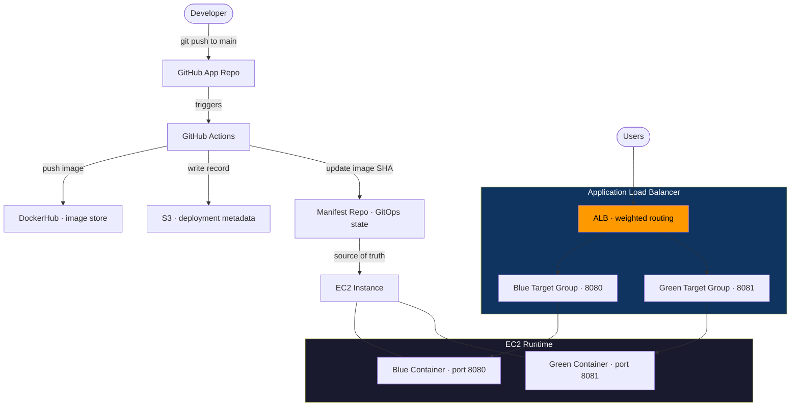
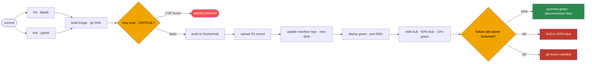

# Secure CI/CD with GitOps and Automated Rollback

> A fault-tolerant deployment pipeline that minimizes production risk using canary releases, health-based validation, and instant rollback with GitOps consistency.


---

## TL;DR

Engineered a production-grade, GitOps-driven CI/CD pipeline that prioritizes real-world deployment safety and failure-driven engineering. Moving far beyond basic push-to-deploy setups, the system integrates robust supply chain security, isolated manifest repositories, AWS ALB-managed canary traffic shifting, and automated traffic-and-state rollbacks triggered by strict runtime health validation.

---

## Tech Stack

| Category       | Tools                              |
|----------------|------------------------------------|
| CI/CD          | GitHub Actions                     |
| Security       | Trivy (CVE scanning)               |
| Registry       | DockerHub                          |
| Infra          | AWS EC2, ALB, S3                   |
| Observability  | ALB Health Checks, CloudWatch      |
| GitOps         | Manifest Repository Pattern        |
| Language       | Python 3.12 / Fast API             |

---

## Key Engineering Highlights

- GitOps-based deployment using a separate manifest repository
- Blue/Green deployment with ALB weighted traffic shifting
- Canary rollout (gradual traffic exposure before full promotion)
- Failure-rate–based validation (not just health checks)
- Automated rollback strategy:
  - Traffic rollback (ALB weight reset)
  - State rollback (Git revert in manifest repo)
- Security gating using Trivy (blocks CRITICAL vulnerabilities)
- Immutable image tagging using commit SHA

---

## [Architecture](./docs/architecture.md)



**Key design principle:** The pipeline never applies infrastructure changes directly. It updates the manifest repo and stops. The system is designed to be compatible with GitOps agents like ArgoCD (not deployed in this project), which would pull and apply the desired state.

---

## Pipeline Flow



---

## Design Decisions & Tradeoffs

### GitOps over direct `kubectl apply`
The pipeline commits image tag changes to a separate manifest repo rather than applying them directly to the cluster. This provides a complete Git audit trail of every deployment, enables rollback via `git revert`, and removes the need to expose cluster credentials to the pipeline. Tradeoff: adds operational complexity — a manifest repo and sync agent must be maintained.

### ALB over NGINX for traffic control
AWS ALB provides native target group weight management, built-in health checks, and CloudWatch metric integration without additional tooling. NGINX would require running and managing a reverse proxy layer. Tradeoff: ALB has per-hour cost; NGINX is free but adds operational burden.

### Canary (90/10) instead of full blue/green switch
Shifting 10% of traffic to Green first limits blast radius — if Green is broken, only 10% of users are affected during the validation window. Full blue/green switches 100% atomically, which is faster but riskier. Tradeoff: canary is slower to fully promote and requires a validation loop.

### Trivy CRITICAL-only failure threshold
Failing the pipeline on HIGH and above generates alert fatigue — teams start ignoring failures or adding `continue-on-error: true`, which defeats security scanning entirely. CRITICAL CVEs represent actively exploitable, high-impact vulnerabilities that must block deployment. HIGH and below are reported and tracked but don't block. Tradeoff: a HIGH vulnerability could reach production; mitigated by regular scheduled scans and SBOM tracking.

### Failure rate validation over single health check
A single `/health` endpoint returning 200 doesn't reflect real application health — it only proves the process is alive. Monitoring the failure rate of actual traffic requests during the canary window catches errors that a shallow health check misses. Tradeoff: requires a validation window (time cost) rather than instant promotion.

---

## Deployment Strategy

Blue/Green deployment runs on a single EC2 instance with two containers:

| Environment | Version      | Port | Traffic (initial) |
|-------------|--------------|------|-------------------|
| Blue        | Current      | 8080 | 90%               |
| Green       | New (canary) | 8081 | 10%               |

**Promotion flow:**
1. Green deployed and registered with Green target group
2. ALB listener rule updated: Blue 90 / Green 10
3. Validation loop runs — monitors failure rate over a time window
4. If healthy: ALB updated to Blue 0 / Green 100, Blue decommissioned
5. If unhealthy: automatic rollback triggered (see below)

**Why keep Blue running during canary?**
Instant rollback requires Blue to be live. Terminating Blue before Green is validated removes the safety net.

---

## Rollback Mechanism

### Trigger
- Failure rate ≥ configured threshold during canary validation window
- ALB health check: target marked unhealthy (3 consecutive failures × 30s interval = 90s detection window)

### Steps
1. ALB listener rule updated → 100% Blue, 0% Green
2. In-flight Green requests complete (connection draining: 30–60s)
3. `git revert` executed on manifest repo — explicit rollback commit with message referencing the failed SHA
4. Green container stopped and deregistered from target group
5. On-call notification triggered

### Why two rollback actions are required
The ALB switch is the **fast action** — stops user impact immediately. The manifest repo revert is the **state action** — ensures Git reflects reality and the next pipeline run doesn't re-deploy the broken image. Skipping the manifest revert leaves an incomplete audit trail and risks redeploying the broken version.

### Rollback type
Traffic rollback + State rollback (GitOps-consistent)

---

## Failure Injection Strategy

To validate rollback behavior, controlled failures were introduced:

- Application returning HTTP 500 on root endpoint
- ALB returning 502 when target becomes unhealthy

This ensures the system is tested under real runtime failure conditions rather than only build-time failures, validating both detection and recovery mechanisms.

---

## Failure Scenarios

| Scenario | Pipeline Stage | Error Message | Root Cause | Resolution |
|---|---|---|---|---|
| [Wrong SSH key in secrets](./incident_reports/ssh-key-failure.md) | deploy — git clone manifest repo | `Permission denied (publickey)` | Private key in secret doesn't match public deploy key registered in manifest repo | Replace `MANIFEST_REPO_SSH_KEY` secret with correct private key |
| [Dockerfile syntax error](./incident_reports/dockerfile-syntax-error.md) | build — docker build | `unknown instruction: FORM` (or similar) | Typo in Dockerfile instruction | Fix Dockerfile syntax, repush |
| [CRITICAL CVE introduced](./incident_reports/trivy-cve-failure.md) | scan — trivy | `exit code 1`, CVE list printed | Vulnerable package version in `requirements.txt` | Update or replace the vulnerable package |
| [Runtime 500 errors post-deploy](./incident_reports/runtime-healthcheck-failure.md) | post-deploy validation | Failure rate ≥ threshold | Application bug in new version not caught by unit tests | Automatic rollback triggers — fix bug, create new commit |
| [ALB misconfiguration](./incident_reports/alb-misconfiguration.md) | post-deploy | `502 Bad Gateway` | Target group pointing to wrong port or unhealthy targets | Verify target group port config (8080/8081), check security group rules |

---

## Project Structure

```
secure-cicd-gitops-pipeline/
├── .github/
│   └── workflows/
│       └── pipeline.yml        # Full CI/CD pipeline definition
├── app/
│   ├── app.py                  # Fast API application
│   └── requirements.txt        # Python dependencies
├── tests/
│   └── test_app.py             # Unit tests (pytest)
├── Dockerfile                  # Multi-stage build, non-root user
├── .dockerignore
└── README.md

# Separate manifest repo: app-manifest-repo/
├── k8s/
│   └── deployment.yaml         # Image tag updated by pipeline on every deploy
└── README.md
```

---

## Setup & Prerequisites

### GitHub Secrets Required

| Secret | Description |
|---|---|
| `DOCKER_USERNAME` | DockerHub username |
| `DOCKER_PASSWORD` | DockerHub password or access token |
| `AWS_ACCESS_KEY_ID` | AWS credentials for EC2/ALB/S3 access |
| `AWS_SECRET_ACCESS_KEY` | AWS secret key |
| `AWS_REGION` | Target AWS region (e.g. `ap-south-1`) |
| `MANIFEST_REPO_SSH_KEY` | Private SSH key — public key registered as deploy key in manifest repo |
| `EC2_HOST` | Public IP or DNS of EC2 instance |
| `EC2_SSH_KEY` | Private key for SSH access to EC2 |

> **Known limitation on auth**: This project uses static AWS credentials for simplicity during initial build. Production improvement: replace `AWS_ACCESS_KEY_ID` / `AWS_SECRET_ACCESS_KEY` with OIDC identity federation — IAM role trust policy scoped to this specific repo and branch, no stored credentials.

### AWS Infrastructure (Manual Provisioning)

1. **EC2 instance** — Ubuntu 22.04, Docker installed, ports 8080 and 8081 open in security group
2. **Application Load Balancer** — internet-facing, HTTP listener on port 80
3. **Two target groups:**
   - `blue-tg` → EC2 port 8080, health check path `/health`
   - `green-tg` → EC2 port 8081, health check path `/health`
4. **S3 bucket** — `veera-deployment-records` with folders: `deployments/`, `sboms/`
5. **CloudWatch alarm** — on `HTTPCode_Target_5XX_Count` metric from ALB, threshold ≥ 5 errors in 60s

---

## How to Run

1. Fork this repo and the manifest repo
2. Configure all GitHub Secrets listed above
3. Provision AWS infrastructure per prerequisites
4. Push any commit to `main`
5. Push any commit to main and monitor the pipeline in GitHub Actions

---

## Demo

### Successful Deployment (Happy Path)


Shows:
- CI/CD pipeline execution
- Canary deployment (90/10)
- Validation success
- Promotion to 100% Green

---

### Failure Handling & Rollback


Shows:
- Runtime failure injection
- Failure rate detection
- Automatic rollback (ALB traffic shift)
- GitOps state revert via manifest repo

---

## Observability

### Structured Logging

The application implements basic structured logging using Python’s logging module:

- Logs include timestamp, log level, and message format
- Captures incoming requests and response status codes
- Example format:
  2026-04-21 10:00:00 | INFO | Incoming request: GET /

Logs are accessible via:
- `docker logs blue`
- `docker logs green`

Note:
Logging is local to containers and not centralized. In production, this would be extended using systems like CloudWatch or ELK for aggregation and analysis.

---

## Known Limitations

- **Static AWS credentials** — uses access key/secret for simplicity. Should be replaced with OIDC federation in production (see Setup notes above)
- **No ArgoCD/Flux** — manifest repo pattern is implemented and ArgoCD-ready, but the cluster sync agent is not provisioned due to cost constraints. The pipeline correctly stops at manifest repo update; a GitOps agent would complete the loop
- **Single EC2 instance** — Blue and Green run on the same host. A real production setup would use separate instances or ECS tasks per target group
- **Single region** — no multi-region failover
- **Shallow health check** — `/health` endpoint returns 200 if the process is alive. A production health check would verify database connectivity and critical dependencies
- **Manual infra provisioning** — ALB, EC2, and target groups are set up manually. Next iteration will use Terraform

---

## Future Improvements

- Replace static AWS credentials with OIDC (IAM role + GitHub identity federation)
- Add Terraform module for full infra provisioning (EC2, ALB, target groups, S3, CloudWatch)
- Integrate ArgoCD for true pull-based GitOps cluster sync
- Add Prometheus + Grafana or CloudWatch dashboards for real-time observability
- Multi-stage canary rollout: 10% → 25% → 50% → 100% with validation at each step
- Retry and backoff logic in validation loop
- Slack / webhook alerting on rollback events
- Migrate to Kubernetes (EKS) — covered in next project
- Add cosign image signing for full supply chain verification
- SBOM generation and storage per build for CVE audit queries