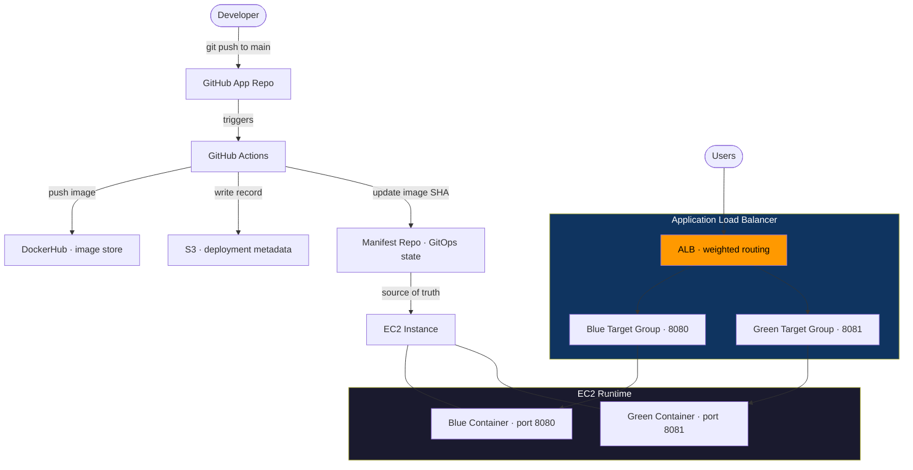

# Architecture

This document describes the system components, how they connect, how data flows through the pipeline, and the key design decisions behind this project.

---

## Table of Contents

1. [System Components](#system-components)
2. [Architecture Diagram](#architecture-diagram)
3. [Request Flow](#request-flow)
4. [Deployment Flow](#deployment-flow)
5. [Validation and Rollback Flow](#validation-and-rollback-flow)
6. [Data and State Locations](#data-and-state-locations)
7. [Failure Points](#failure-points)
8. [Key Design Decisions](#key-design-decisions)

---

## System Components

### Developer
The engineer pushing code changes.
- Pushes commits to the GitHub app repo
- Triggers the CI/CD pipeline on every push to `main`

---

### GitHub App Repo
Source of truth for application code.
- Stores application code, Dockerfile, tests, and pipeline definition
- Triggers GitHub Actions on push to `main`

---

### GitHub Actions
Automates the full build, validation, and deployment workflow.
- Runs lint and test jobs in parallel
- Builds Docker image tagged with immutable commit SHA
- Performs security scanning with Trivy — blocks pipeline on CRITICAL CVEs
- Pushes verified image to DockerHub
- Writes deployment metadata to S3
- Updates manifest repo with new image SHA (GitOps handoff)

---

### DockerHub
Container registry — stores versioned, immutable images.
- Every image tagged with commit SHA (e.g. `cicd-app:bb81620`)
- Pulled by EC2 at deploy time
- No `latest` tag used in production — all references are immutable

---

### S3 (Deployment Metadata Store)
Stores per-deployment metadata for audit and incident debugging.

Each record contains:
- Commit SHA
- Image tag
- Timestamp
- Trivy scan status

Used for:
- Post-incident investigation ("what was running at 14:42?")
- Audit trail of every promoted deployment
- SBOM cross-referencing (future)

---

### Manifest Repo (GitOps State)
Stores the desired deployment state as code.
- Contains `deployment.yml` with the current target image tag
- Updated by the pipeline after a successful image push
- Acts as the **single source of truth** for what version should be running
- Rollback is implemented as a `git revert` on this repo — no pipeline re-run required

---

### EC2 Instance (Runtime Environment)
Hosts both Blue and Green application containers.
- Docker used as container runtime
- Blue container → port `8080` (stable, current version)
- Green container → port `8081` (new version, canary target)
- Both containers run simultaneously during the canary validation window

---

### Application Load Balancer (ALB)
Controls all traffic routing between Blue and Green.
- Weighted routing via listener rules on target groups
- Canary split: 90% Blue / 10% Green during validation
- Performs health checks on both target groups
- Traffic switch is atomic — one API call, zero downtime

---

### Target Groups
Logical routing groups attached to the ALB.

| Target Group | Port | Version |
|---|---|---|
| `blue-tg` | 8080 | Stable (current) |
| `green-tg` | 8081 | Canary (new) |

Health check path: `/health` on each respective port.

---

### Validation Logic (Pipeline Stage)
Determines whether to promote Green or trigger rollback.
- Sends multiple HTTP requests to the ALB during the canary window
- Calculates failure rate from responses
- Failure threshold: ≥ 20% error rate triggers rollback
- Retries built in to avoid false positives from transient errors

---

### Users
End users accessing the application via browser or API client.
- All requests go through the ALB — no direct container access
- During canary: 10% of users hit Green, 90% hit Blue
- On promotion: 100% routed to Green
- On rollback: 100% returned to Blue — invisible to users

---

## Architecture Diagram



---

## Request Flow

```
User sends request
        ↓
ALB receives request
        ↓
ALB applies listener rule weights
        ├── 90% → Blue Target Group → Blue Container (port 8080)
        └── 10% → Green Target Group → Green Container (port 8081)
        ↓
Container processes request
        ↓
Response returns to user via ALB
```

---

## Deployment Flow

```
1. Developer pushes commit to main

2. GitHub Actions triggers:
   ├── lint (flake8) ──┐
   └── test (pytest) ──┴──→ build Docker image (tagged: git SHA)
                               ↓
                          Trivy scan (CRITICAL CVE check)
                               ↓ (clean)
                          push image to DockerHub
                               ↓
                          upload deployment record to S3
                               ↓
                          update manifest repo with new SHA

3. EC2 pulls new image, starts Green container on port 8081

4. ALB listener rule updated: 90% Blue / 10% Green

5. Validation loop runs (see below)

6a. PASS → ALB updated to 100% Green · Blue decommissioned
6b. FAIL → Automatic rollback triggered (see below)
```

---

## Validation and Rollback Flow

### Validation
- 20 HTTP requests sent to ALB during canary window
- Failure rate calculated from responses
- Threshold: ≥ 20% failure rate triggers rollback
- Retries included to avoid false positives from transient errors

### Rollback (if threshold breached)

```
Failure detected
        ↓
ALB listener rule updated → 100% Blue, 0% Green
        ↓
In-flight Green requests complete (connection draining: 30–60s)
        ↓
git revert executed on manifest repo
(explicit rollback commit with failed SHA referenced in message)
        ↓
Green container stopped and deregistered
        ↓
On-call notification triggered
        ↓
System restored to last known good state
```

> **Why two rollback actions?**
> The ALB switch is the fast action — stops user impact in seconds. The `git revert` is the state action — keeps Git as the source of truth and prevents the broken image from being redeployed on the next pipeline run. Both are required.

---

## Data and State Locations

| What | Where | Format |
|---|---|---|
| Application code | GitHub App Repo | Source files |
| Pipeline definition | GitHub App Repo · `.github/workflows/` | YAML |
| Built images | DockerHub | OCI image · SHA tag |
| Desired deployment state | Manifest Repo · `manifests/deployment.yml` | YAML |
| Deployment metadata | S3 · `deployments/<date>/<sha>.json` | JSON |
| Runtime containers | EC2 · ports 8080 / 8081 | Docker |

---

## Failure Points

| Stage | Failure Mode | Symptom |
|---|---|---|
| CI · lint/test | Code quality or test failure | Pipeline stops · build never starts |
| CI · build | Dockerfile syntax error | `unknown instruction` error · build fails |
| CI · scan | CRITICAL CVE in image | `exit code 1` · image never pushed |
| Deploy · git clone | Wrong SSH key in secrets | `Permission denied (publickey)` |
| Deploy · runtime | Application 500 errors | Failure rate ≥ threshold · rollback triggers |
| Infra · ALB | Target group misconfiguration | `502 Bad Gateway` · all requests fail |

---

## Key Design Decisions

### GitOps-based deployment over direct `kubectl apply`
The pipeline commits image tag changes to a manifest repo and stops. It never touches the runtime environment directly. This gives a complete Git audit trail of every deployment, enables rollback via `git revert`, and removes the need to expose cluster or EC2 credentials to the pipeline.

**Tradeoff:** Adds a manifest repo to maintain and requires a sync mechanism (ArgoCD-ready but not provisioned — see Known Limitations in README).

---

### Blue/Green with canary validation over full atomic switch
Running 10% of traffic through Green before full promotion limits blast radius. If Green is broken, only 10% of users see errors during the validation window. A full atomic switch is faster but exposes 100% of users to a bad deploy immediately.

**Tradeoff:** Canary requires a validation window (time cost) and more complex ALB rule management.

---

### Immutable image tagging with commit SHA
Every image is tagged with its exact commit SHA. There is no `latest` tag in production. This means any running container is traceable to an exact commit, rollback is reliable (the previous SHA always refers to the same image), and accidental overwrites are impossible.

**Tradeoff:** Requires lifecycle policies on DockerHub/ECR to manage storage growth.

---

### Trivy CRITICAL-only failure threshold
Failing on HIGH and above generates alert fatigue — teams start bypassing scans with `continue-on-error: true`, which defeats the purpose entirely. CRITICAL CVEs represent actively exploitable vulnerabilities that must block deployment. HIGH and below are reported but do not block.

**Tradeoff:** A HIGH vulnerability can reach production. Mitigated by scheduled scans and SBOM tracking (planned).

---

### Failure rate validation over single health check
A `/health` endpoint returning 200 only proves the process is alive. It does not reflect errors on other routes. Monitoring the actual failure rate of real traffic through the canary window catches application-level errors that a shallow health check misses.

**Tradeoff:** Requires a validation window rather than instant promotion. 20 requests over a time period means slower deploys.

---

### Dual rollback — traffic and state
Rollback requires two actions: switching the ALB back to Blue (fast, stops user impact) and reverting the manifest repo commit (state, maintains Git as source of truth). Performing only the ALB switch leaves Git out of sync — the next pipeline run would re-deploy the broken image. Performing only the manifest revert leaves users on the broken Green while Git catches up.

Both actions are always performed together.